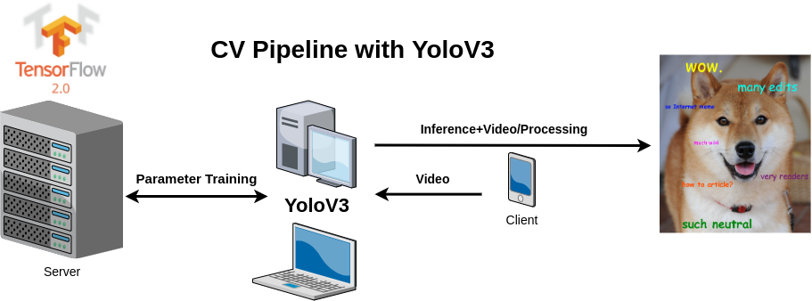

# Simple Pipelining scripts using OpenCV + TF 2.0+ Video Feeds
The repository is a simple implementation using TF 2.0, OpenCV2 and video feeds such as the one provided from an android phone webcam. 



The pipeline uses a start-of-the-art arquitecture in computer vision: yolov3 (originally implemented from https://github.com/zzh8829/yolov3-tf2 and forked on https://github.com/DanielLSM/yolov3-tf2). 


# Instalation

##  Ubuntu 18.04 

### Requirements:
- Anaconda 3

##  Instructions 

0) Open a terminal
1) Clone the repository 
```
cd ~
git clone https://github.com/DanielLSM/cv-android-script
```
2) Move to the repository in your system
```
cd cv-android-script/
```
3) Install the anaconda environment
```
conda env create -f wasp.yml
```
4) Load the anaconda environment
```
conda activate wasp
```
5) Install this package on the environment
```
pip install -e .
```
6) Obtain parameters
- download the parameters folder and uncompress inside this repository (just next to this README.md)
https://drive.google.com/file/d/1q09a2FNUCZHRddGFrN9xRICekV3rKK9C/view?usp=sharing
7) install modified yolov3
pip install git+https://github.com/DanielLSM/yolov3-tf2.git
## Training

To train on other dataset, you need to generate tfrecord, for example using [Microsoft VOTT](https://github.com/Microsoft/VoTT) to generate such dataset.
You can also use this [script](https://github.com/tensorflow/models/blob/master/research/object_detection/dataset_tools/create_pascal_tf_record.py) to create the pascal voc dataset. Once you have generate the tfrecord, you can call ```transfer_learning_train.py``` to train with transfer learning or from random weights.

Here is a bash script ```voc20120_transfer_learning.sh``` downloading VOC2012, generating tfrecord and training with the pretrained darknet weights.
